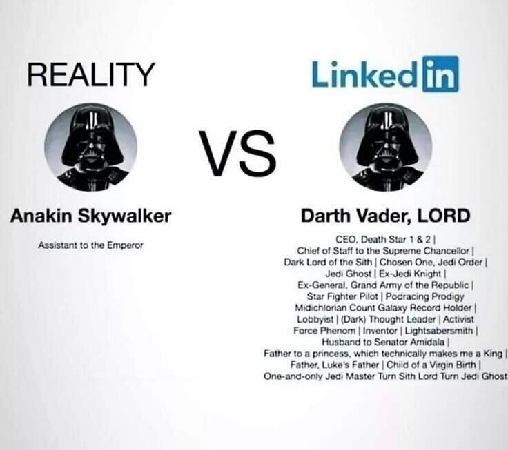

<<<<<<< HEAD
FediWork is a free (as in free speech) and open source employment seeking platform. It is supposed to be an alternative to LinkedIn, Xing, Stepstone and other corporate walled garden job platforms.

This project has been forked from Mastodon because License, Backend and AP protocol are so far the best I could find. I'm also not a fan of reinventing the wheel if the wheel is democratic.

## If you want to know what mastodon is:

Mastodon is a **free, open-source social network server** based on ActivityPub where users can follow friends and discover new ones. On Mastodon, users can publish anything they want: links, pictures, text, and video. All Mastodon servers are interoperable as a federated network (users on one server can seamlessly communicate with users from another one, including non-Mastodon software that implements ActivityPub!)

The original repository is https://github.com/mastodon/mastodon

Both the original and this fork are licensed under [AGPL](LICENSE)

## What makes this Project unique?
=======
> [!NOTE]
> Want to learn more about Mastodon?
> Click below to find out more in a video.

<p align="center">
  <a style="text-decoration:none" href="https://www.youtube.com/watch?v=IPSbNdBmWKE">
    
  </a>
</p>

<p align="center">
  <a style="text-decoration:none" href="https://github.com/mastodon/mastodon/releases">
    </a>
  <a style="text-decoration:none" href="https://github.com/mastodon/mastodon/actions/workflows/test-ruby.yml">
    </a>
  <a style="text-decoration:none" href="https://crowdin.com/project/mastodon">
    </a>
</p>

Mastodon is a **free, open-source social network server** based on [ActivityPub](https://www.w3.org/TR/activitypub/) where users can follow friends and discover new ones. On Mastodon, users can publish anything they want: links, pictures, text, and video. All Mastodon servers are interoperable as a federated network (users on one server can seamlessly communicate with users from another one, including non-Mastodon software that implements ActivityPub!)
>>>>>>> upstream/main

This project is supposed to democratize (as in direct democracy, not "democracy") job platforms by making them federated.

<<<<<<< HEAD
So far, the project is in its infancy and will be for some time in the future. The planned (unique) features so far are:

- Encrypted personal data (clear name, address, places of work, exact employment dates, phone number and email adress)
- (possibly) p2p transfer of the encrypted dataset to a potential employer
- wide range of fields in the profile such as a blog style work experience section (workplace1, workplace2, etc.) and a list of skills
- filter or matching for employers to find suitable candidates and job seekers to find suitable employers
- absolutely no pay2win, so employers cant buy their way to the candidate. They need to get upvotes or match the search terms
- obviously no "ads" aside from the job postings, which can be reported if they are discriminatory or false
- (possibly) auto delete function for cv data if no agreement is reached after sending it
- interoperability with other AP services and possibly cross employment offers (depending on the technical capabilities of the client)
- Job offers require a verified link (and possibly the verified link is manually checked after)
=======
- [Project homepage 🐘](https://joinmastodon.org)
- [Donate to support development 🎁](https://joinmastodon.org/sponsors#donate)
  - [View sponsors](https://joinmastodon.org/sponsors)
- [Blog 📰](https://blog.joinmastodon.org)
- [Documentation 📚](https://docs.joinmastodon.org)
- [Official container image 🚢](https://github.com/mastodon/mastodon/pkgs/container/mastodon)
>>>>>>> upstream/main

## Why do we need a federated Job platform?
Because we have a tremendous shortage of honesty in our current job platforms. Depending on the country, the government agencies are not equipped to handle the modern job market and the private platforms are rigged towards extracting money from both the company (fair, imo) and the candidate. People are encouraged to pay fees to get ahead in the job race, which creates very negative tendencies on current job platforms.

<<<<<<< HEAD
Memes like this one are very accurate imo:



A federated version could make it so positive interaction with employers and other job seekers gets you up. Like forwarding a job offer that doesnt fit you to someone who you think fits. If they match, even better.

Enough rambling, I'm not a pro dev so this will probably take a long time and I need to learn a lot. Feel free to help with whatever you like.

Thank you very much for reading and have a great day.
=======


**Part of the Fediverse. Based on open standards, with no vendor lock-in.** - the network goes beyond just Mastodon; anything that implements ActivityPub is part of a broader social network known as [the Fediverse](https://jointhefediverse.net/). You can follow and interact with users on other servers (including those running different software), and they can follow you back.

**Real-time, chronological timeline updates** - updates of people you're following appear in real-time in the UI.

**Media attachments** - upload and view images and videos attached to the updates. Videos with no audio track are treated like animated GIFs; normal videos loop continuously.

**Safety and moderation tools** - Mastodon includes private posts, locked accounts, phrase filtering, muting, blocking, and many other features, along with a reporting and moderation system.

**OAuth2 and a straightforward REST API** - Mastodon acts as an OAuth2 provider, and third party apps can use the REST and Streaming APIs. This results in a [rich app ecosystem](https://joinmastodon.org/apps) with a variety of choices!

## Deployment

### Tech stack

- [Ruby on Rails](https://github.com/rails/rails) powers the REST API and other web pages.
- [PostgreSQL](https://www.postgresql.org/) is the main database.
- [Redis](https://redis.io/) and [Sidekiq](https://sidekiq.org/) are used for caching and queueing.
- [Node.js](https://nodejs.org/) powers the streaming API.
- [React.js](https://reactjs.org/) and [Redux](https://redux.js.org/) are used for the dynamic parts of the interface.
- [BrowserStack](https://www.browserstack.com/) supports testing on real devices and browsers. (This project is tested with BrowserStack)
- [Chromatic](https://www.chromatic.com/) provides visual regression testing. (This project is tested with Chromatic)

### Requirements

- **Ruby** 3.2+
- **PostgreSQL** 14+
- **Redis** 7.0+
- **Node.js** 20+

This repository includes deployment configurations for **Docker and docker-compose**, as well as for other environments like Heroku and Scalingo. For Helm charts, reference the [mastodon/chart repository](https://github.com/mastodon/chart). A [**standalone** installation guide](https://docs.joinmastodon.org/admin/install/) is available in the main documentation.

## Contributing

Mastodon is **free, open-source software** licensed under **AGPLv3**. We welcome contributions and help from anyone who wants to improve the project.

You should read the overall [CONTRIBUTING](https://github.com/mastodon/.github/blob/main/CONTRIBUTING.md) guide, which covers our development processes.

You should also read and understand the [CODE OF CONDUCT](https://github.com/mastodon/.github/blob/main/CODE_OF_CONDUCT.md) that enables us to maintain a welcoming and inclusive community. Collaboration begins with mutual respect and understanding.

You can learn about setting up a development environment in the [DEVELOPMENT](docs/DEVELOPMENT.md) documentation.

If you would like to help with translations 🌐 you can do so on [Crowdin](https://crowdin.com/project/mastodon).

## LICENSE

Copyright (c) 2016-2025 Eugen Rochko (+ [`mastodon authors`](AUTHORS.md))

Licensed under GNU Affero General Public License as stated in the [LICENSE](LICENSE):

```text
Copyright (c) 2016-2025 Eugen Rochko & other Mastodon contributors

This program is free software: you can redistribute it and/or modify it under
the terms of the GNU Affero General Public License as published by the Free
Software Foundation, either version 3 of the License, or (at your option) any
later version.

This program is distributed in the hope that it will be useful, but WITHOUT
ANY WARRANTY; without even the implied warranty of MERCHANTABILITY or FITNESS
FOR A PARTICULAR PURPOSE. See the GNU Affero General Public License for more
details.

You should have received a copy of the GNU Affero General Public License along
with this program. If not, see https://www.gnu.org/licenses/
```
>>>>>>> upstream/main
